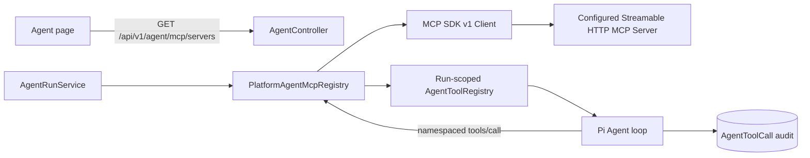

## Context

`add-pi-web-agent` 已建立服务端 Agent loop、Tool registry、MCP 空端口和不可信上下文边界；
`add-agent-web-search` 已用固定 JSON-RPC MCP 请求验证搜索服务，但它只封装两个已知 provider，
不具备标准 initialize、动态 `tools/list` 或通用工具注册。

当前前端使用 assistant-ui 的 `useLocalRuntime` 适配自研 NestJS Agent API，而不是 AI SDK chat
runtime。浏览器端 `@assistant-ui/react-mcp` 会把连接和认证状态放入浏览器 runtime，与“API 是
认证/凭证/审计真源”的既定架构冲突，因此本 change 保持 MCP 在 NestJS 服务端。

## Goals / Non-Goals

**Goals:**

- 通过环境配置平台批准的远程 Streamable HTTP MCP Server 和精确工具白名单。
- 使用官方 MCP SDK v1 完成协议握手、分页发现和调用。
- 在每次 Agent run 开始前生成不可变的合并工具集合，避免运行中工具漂移。
- 保证超时、取消、输出上限、命名冲突、错误归一化和凭证脱敏。
- 给已登录用户提供只读状态与通用动态工具 UI。

**Non-Goals:**

- 用户自助 Server CRUD、OAuth、Bearer Token 输入或跨设备凭证存储。
- stdio/本地子进程、legacy SSE、resources、prompts、sampling、elicitation。
- MCP 写入/破坏性工具与审批流。
- 后台定时健康检查、自动重连或多机连接协调。

## Architecture

## Decisions

### Decision 1: Platform-managed static configuration

`AGENT_MCP_SERVERS_JSON` is a JSON array. Each server contains:

- stable lowercase `id`, display `name`, bounded `description`, absolute `url`;
- `auth.type=none` or `auth.type=bearer` plus `tokenEnv`;
- a non-empty `tools` allowlist with remote `name` and risk level limited to `read` or
  `external_send`.

The model and browser cannot supply URL, headers, token environment name or remote tool name.
Production requires HTTPS. Development/test may use loopback HTTP for deterministic fixtures.

### Decision 2: Official SDK v1 and Streamable HTTP only

Use `@modelcontextprotocol/sdk@1.29.0`, because official guidance still recommends v1 for production
while v2 remains beta. One client connection is created for bounded discovery or invocation and closed
in `finally`; V1 avoids process-global sessions and stale reconnect state. Discovery follows
`nextCursor` with a page/tool cap.

### Decision 3: Exact allowlist intersection and namespaced names

Only remote tools present in both `tools/list` and platform configuration are exposed. Public names use
`mcp__<server-id>__<remote-name>` after strict identifier validation; duplicates fail closed.
Remote descriptions and schemas are bounded before entering the model prompt. Unsupported/non-object
schemas are rejected rather than weakened.

### Decision 4: Immutable run-scoped tool registry

At run start, `AgentRunService` resolves MCP tools once and constructs a new
`AgentToolRegistry([...builtIns, ...mcpTools])`. The same definitions are used for Prompt composition,
context budgeting, Pi conversion and execution for the entire run.

If one configured server cannot be discovered, its tools are absent and its status is `error`; other
servers and built-in tools remain available. If no MCP configuration exists, no network request occurs.

### Decision 5: Untrusted bounded result envelope

Text content and resource links from `tools/call` are converted into bounded text. The model receives an
explicit `[UNTRUSTED MCP TOOL RESULT]` wrapper. Embedded instructions cannot extend the tool allowlist.
Audit contains server ID, remote tool name, duration, content block count, truncation and normalized
error code, never URL query secrets, bearer tokens, raw headers or full result content.

### Decision 6: Read-only status, no browser credential manager

`GET /api/v1/agent/mcp/servers` returns id/name/description/status/tool counts/error code and never URL,
headers or auth. The SDK decodes this projection. Agent UI shows a compact readiness summary and uses a
generic activity card for any `mcp__` tool call.

## Failure Handling

- Invalid configuration fails application startup with field-scoped environment errors.
- Discovery timeout/protocol failure marks only that Server unavailable for the run.
- Invocation cancellation maps to `MCP_TOOL_ABORTED`; timeout, protocol, size and remote failures use
  stable error codes and produce failed tool events.
- A configured allowlisted tool missing remotely is not registered.
- The response body and model-visible output are independently bounded.

## Security

- Credentials are referenced by environment variable name and resolved only inside NestJS.
- Production rejects non-HTTPS endpoints; local HTTP must be loopback.
- Exact configured tools only; no arbitrary endpoint, remote header or tool name from model input.
- V1 permits only `read` and `external_send`; write/destructive tools wait for an approval change.
- MCP metadata and outputs remain untrusted and escaped/bounded.

## Test Strategy

- Unit: config parser, namespacing, whitelist intersection, redaction, result normalization.
- Contract: local official-SDK Streamable HTTP fixture covers initialize/list/call and cancellation.
- Agent integration: resolved tool is present in prompt and persisted tool lifecycle.
- SDK/Web: status decode and generic MCP activity rendering.
- Explicit smoke: start local fixture, configure one echo tool, run discovery/call without external
  network or credentials.

## Rollback

Clear `AGENT_MCP_SERVERS_JSON` to disable all generic MCP connections immediately, then revert the
feature commits if needed. No schema rollback is required and existing audit rows remain readable.
