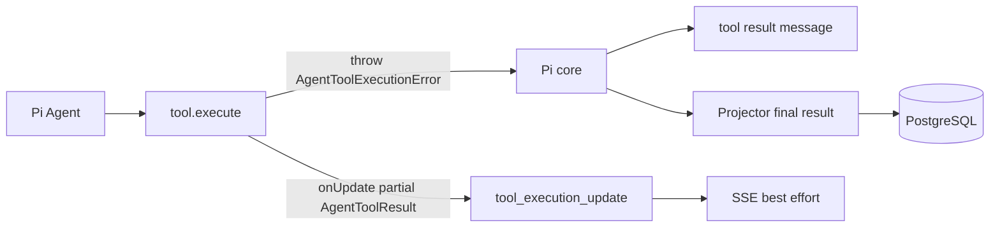

# Design: Pi-compatible tool errors and progress

## Scope

本 change 只负责两件事：统一工具错误结构，以及复用 Pi 原生工具进度协议。Pi core 负责捕获
工具异常、生成失败 tool result，并决定 Agent 是否继续；项目不重写 Agent loop。



## Decisions

1. 已知业务错误由工具自己构造 `AgentToolExecutionError`；Registry 只包装未知异常。
2. `Error.message` 必须是 Pi 直接消费的自然语言字符串，说明为什么错、怎么改；不引入 Pi
   不支持的 JSON message 协议。
3. `code`、`summary`、`retryable` 和 `audit` 保留为项目元数据，供日志、OTel、UI 和审计使用。
4. Pi 负责错误结果和 Agent 控制流；项目不自动重试、不重放、不强制继续下一轮。
5. 进度复用 Pi 的 `onUpdate(partial AgentToolResult)` 和 `tool_execution_update`，只通过 SSE
   best-effort 广播，不持久化、不进入模型上下文。
6. OTel 主 span 保持在 Registry 工具调用边界；埋点失败不得改变工具错误传播。

## Error contract

```ts
class AgentToolExecutionError extends Error {
  readonly code: string
  readonly summary: string
  readonly retryable: boolean
  readonly audit?: Record<string, unknown>
}
```

`message` 是普通字符串；业务 context 可以扩展，但在离开工具边界前统一脱敏、限长和限制嵌套。
原始 `cause` 只进入服务端日志，不进入模型、OTel 或持久化结果。

## Progress contract

工具调用 Pi 的 `onUpdate(partial AgentToolResult)`。项目只转发 Pi 生成的
`tool_execution_update`，中间 update 可丢失；最终 `tool_execution_end` 才是权威结果。

## Verification

- 已知错误、未知异常、取消、MCP/Sandbox 错误均能生成统一异常字段。
- 错误 message 具体可修复，敏感值不会越过公共过滤边界。
- `onUpdate` 能映射到 SSE，不写 PostgreSQL，不进入模型历史。
- progress 广播失败不影响最终工具结果。
