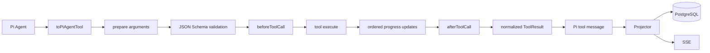

# Design: Agent 工具错误韧性与状态一致性

## Architecture

工具定义仍保持平台中立，由 `AgentToolRegistry` 管理 allowlist，由 `toPiAgentTool` 适配为
Pi `AgentTool`。新增的统一执行边界只包住工具调用，不包住整个 Agent loop：



## Decisions

1. `AgentToolDefinition` 增加可选 `prepareArguments`、`beforeExecute`、`afterExecute`、
   `executionMode` 能力；旧工具未实现时保持现有行为。
2. `toPiAgentTool.execute` 是项目级最后兜底：无论 registry 或工具实现如何抛错，都转换为
   Pi 可消费的失败结果，并保留错误码、retryable、summary 和 audit。
3. `AgentToolResult` 继续作为模型可见结果的规范；内部异常只进入日志/telemetry，不作为
   Agent loop 的控制信号。
4. 进度通过受控的 `onUpdate`/`onProgress` 投影为 `tool-execution-update`；工具 Promise settle
   后关闭更新闸门，并在发送最终失败结果前等待已排队更新。
5. 工具执行模式默认保持 Pi 现有兼容行为，但写入、导出、skill 激活等有副作用工具明确
   标记为 sequential；必要时由工具内部锁保护同一资源。
6. `AgentRunProjector.finalize` 为尚未收到 end 的工具生成补偿失败/取消结果，并保证只生成
   一次；补偿事件先落库再广播。
7. `beforeExecute` 只做服务端 allowlist、scope、风险和参数相关的拒绝，不接受浏览器传入的
   权限描述；当前 V1 不实现人工审批。

## Error envelope

```ts
type AgentToolError = {
  code: string
  message: string       // 给模型，具体且可纠错
  summary: string       // 给 UI，简短
  retryable: boolean
  audit?: Record<string, unknown>
}
```

错误码从结构化 `audit.code` 读取；`[CODE] message` 只保留为兼容旧 Pi 结果的 fallback。
错误消息不得包含凭证、Authorization、Cookie、session secret 或完整敏感响应头。

## Failure boundaries

- 工具内部业务失败：`tool-result.failed`，Agent 可继续。
- 工具取消：`tool-result.cancelled` 或带 `AGENT_TOOL_ABORTED` 的失败结果，run 根据全局
  AbortSignal 进入 `cancelled`。
- Agent 模型流/上下文/数据库等非工具错误：run 进入 `failed` 或 `limit_reached`。
- finalize 前工具仍为 running：生成 `AGENT_TOOL_INTERRUPTED` 或 `AGENT_TOOL_ABORTED` 补偿结果。

## Verification strategy

- 单元：每个执行管道阶段异常均变成单条失败 tool result；异常码、summary、audit 不丢失。
- 单元：进度更新在最终失败结果前有序，settle 后的孤儿 update 被丢弃。
- 单元：串行工具并发调用不会交叉执行；工具结果仍按调用顺序写入模型上下文。
- 集成：run 在 tool exception 后继续下一轮；异常结束时无遗留 RUNNING tool call。
- E2E：SSE 收到 tool start/update/result、usage 和 run-terminal 的顺序与数据库一致。
