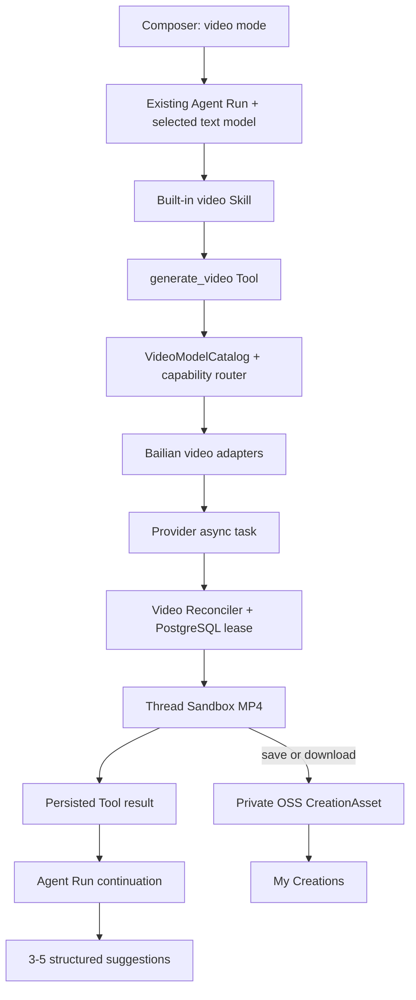

## Context

项目已经具备 Agent Thread/Run、可恢复 SSE、Run-scoped Tool、内置 Skill、Thread Sandbox、Creation/CreationAsset、私有 OSS、RequestLog/BillingRecord 和“我的创作”。现有图片 change 证明了 Agent 编排异步创作任务的方向，但视频具有分钟级执行、大文件 Range 预览、外部模型读取参考图、音频/时长计费和逻辑取消后上游仍运行等额外边界。

百炼四品牌均采用异步创建任务和查询结果，但具体模型对文生视频、首帧生视频、音频、时长、分辨率和比例的支持不同。本 change 只聚合文生视频与单张首帧生视频，不扩展首尾帧、主体/风格参考、视频参考、编辑或续写。

## Goals / Non-Goals

**Goals:**

- 让当前文本模型继续作为外层 Agent，以 Skill + Tool 自动完成视频生成，不要求用户确认付费调用。
- 用版本化能力目录在四品牌中选择可执行模型，并在 Thread 内保持软绑定。
- 使任务不依赖浏览器在线，并可在 API 重启后恢复原任务和 Agent Run。
- 参考图与未保存视频只存在 Thread Sandbox；只有保存或下载才进入私有 OSS。
- 为视频提供安全预览、永久保存、本地下载、连续修改、日志和计费闭环。

**Non-Goals:**

- 不提供视频模型选择器，不向普通用户展示实际模型或候选集合。
- 不实现首尾帧、多参考图、主体/风格参考、视频参考、视频编辑、续写或转码。
- 不自动重试失败任务，不做 Provider failover，不并行执行同一 Thread 的前台 Run。
- 不新增用户控制、feature flag、平台内容审核、视频专属成本硬顶或连续取消防刷策略。
- 不引入 BullMQ、独立 Worker、微服务或多机高可用。

## Architecture



Agent只依赖视频 Tool端口；Tool依赖模型目录和任务服务；百炼字段、鉴权、真实模型 ID与结果 URL不得越过 Adapter层。Web只消费 SDK提供的平台资产标识和同源受控路由。爱诗 PixVerse 的文生与单首帧链路固定使用已开通的 `pixverse/pixverse-v6-r2v`，不得回退到旧版 PixVerse 模型 ID。

## Decisions

### Decision 1: 视频生成是 Thread 级可切换 Run mode

Composer上方提供“对话 / 视频生成”能力入口。模式按 Thread持久化，刷新后保留。视频模式后续消息和建议气泡都走视频 Agent链路；切回对话后只运行普通 Agent。再次切回视频模式时继续继承上一版 Prompt、首帧图、有效参数和视频模型软绑定。

现有模型选择器始终只控制外层文本模型。Agent不得仅凭普通对话中的自然语言自行切换模式，避免误触发付费视频任务。

### Decision 2: 发送即执行完整 Agent Tool loop

视频模式收到 Prompt后，外层 Agent加载内置 Skill和运行环境，在必要时调用`generate_video`。不增加确认步骤；界面只需表达发送会开始生成。成功后Tool返回结构化结果，外层文本模型再调用一次，输出简短回复和3–5条结构化修改建议。

建议由外层 Agent基于本轮内容、实际能力和有效参数动态生成，字段仅为受限的`label`与`prompt`。Web渲染为气泡；点击等价于append一条用户Prompt并开始下一Run。若最后一次文本模型调用失败，视频仍成功展示，服务端返回安全默认建议且不得重新生成视频。

### Decision 3: Thread软绑定实际视频模型

首次生成按任务类型和能力筛出完全满足请求的候选具体模型，优先选择`BAILIAN_VIDEO_DEFAULT_BRAND`配置的品牌并写入Thread视频绑定（环境默认值为HappyHorse）；配置品牌不满足要求时确定性选择其他可用候选。后续优先复用绑定模型；若它无法满足新要求，服务端按相同规则选择满足要求的模型并更新绑定，Web只弹“已为你切换到支持当前要求的视频模型”。

候选集合、实际品牌、真实模型 ID、排除原因和切换原因只写入任务、日志、账单和管理员详情。用户自然语言点名品牌只作为路由偏好；能力不足时仍允许自动切换。

### Decision 4: 能力并集与最佳努力语义

目录按代码评审固定具体模型 ID及其文生视频/首帧生视频、音频、时长、分辨率、比例和模式能力。默认是5秒、720P、音频开启；纯文生视频默认16:9，首帧生视频继承图片比例。

平台不限制用户自然语言。Agent将可识别要求映射到四品牌在两条链路内的能力并集。当前模型不支持而其他模型支持时自动切换；所有模型都不支持时不报错、不提示，沿用上一版合法参数，并把未实现的语义保留在Prompt中正常生成。厂商专属原始字段不向Agent或Web开放。

### Decision 5: 只支持文本和单张首帧输入

无图时执行文生视频；有图时图片严格解释为首帧。只允许一张JPEG、PNG或WEBP，最大10 MB；进入Sandbox前验证真实类型、像素和所有权，必要时转成无透明通道的JPEG/PNG。

连续修改继承上一版完整结构化Prompt、首帧图和有效参数，新Prompt只覆盖明确变化。上一版视频不作为模型输入。本change不启用首尾帧、主体/风格参考、多图、视频参考、编辑或续写。

### Decision 6: 参考图通过私有临时 OSS 签名 URL 供百炼读取

选择参考图时API先确保当前Thread Sandbox可用，浏览器通过owner-scoped同源接口流式上传，Web仅持有`sandboxAssetId`。替换或取消尚未提交的文件时清理；历史任务引用文件保留到Sandbox过期。

选择首帧时，服务端完成所有权、格式和大小校验后直接写入按用户与opaque asset隔离的私有 `video-staging/` OSS 对象，不再复制到Thread Sandbox，并向Web仅返回opaque asset ID。提交时为该对象生成只允许 GET 的短期签名 URL，不依赖用户 Cookie。默认有效30分钟，最长不超过2小时。临时对象不创建 Creation，不进入“我的创作”；未提交图片被替换/移除或任务成功、失败、取消、超时后 best-effort 删除。Bucket SHALL 配置1天生命周期规则，兜底清理进程崩溃或提交不确定窗口产生的残留对象。对象 key 使用不含 Prompt 的不透明标识，签名 URL 不持久化、不进入日志或客户端。

### Decision 7: PostgreSQL lease驱动持久Video Reconciler

付费提交前原子创建RequestLog、VideoGenerationTask和ToolCall关联；写库失败则禁止调用百炼。取得provider task ID后立即持久化。API进程内Reconciler领取到期且lease过期的任务并持续查询，不依赖浏览器轮询；API重启后继续原task ID。

任务平台超时为15分钟。查询状态未知可继续恢复原任务，但任何明确提交失败、异步失败或平台超时都直接失败；不自动重试、不切换模型、不创建替代任务。提交必须携带平台幂等键，恢复路径不得再次发起付费请求。

任务运行期间持有Thread Sandbox lease。成功后先安全下载并写入Sandbox，再提交Tool success；失败、超时或取消后释放lease。

### Decision 8: 取消立即释放前台Run

用户停止后，平台立即将Run和任务标记为逻辑`CANCELLED`，停止向页面回吐，释放Thread前台锁并允许下一Run。服务端best-effort调用百炼取消；即使上游任务仍在物理执行，也不阻塞用户。

后台低频对账厂商最终状态和实际费用。取消后迟到的视频不下载、不预览、不保存。同一Thread可能短暂存在多个上游物理任务，但只允许一个前台有效Run；本change不增加连续取消产生的并发或成本控制。

### Decision 9: Provider结果必须安全进入Sandbox

成功结果采用流式下载，最大500 MB，不整体载入Node内存。仅允许审查过的HTTPS厂商host；默认拒绝重定向，若协议确需则只允许同一受信host的一次HTTPS重定向，并对每次解析执行DNS/IP检查，拒绝私网、回环和链路本地地址。

下载校验Content-Length、真实MP4魔数、MIME、时长和基础媒体信息，同时计算SHA-256。半成品在失败时删除。首版不运行FFmpeg转码；非MP4、浏览器不兼容或异常文件直接失败。Sandbox空间不足时失败，不自动删除其他用户产物。

### Decision 10: 临时视频使用owner-scoped Range预览

未保存视频通过同源鉴权路由读取，支持`Range`、`206 Partial Content`、`Content-Length`、私有缓存和正确`video/mp4`。Web用浮层放大播放，关闭浮层只暂停播放。

临时视频沿用Thread Sandbox生命周期；任务期间lease防止销毁，任务结束后恢复正常过期。过期后消息保留但显示“临时视频已过期”。浏览器永远看不到厂商URL和Sandbox路径。

### Decision 11: 保存与下载共享永久化链路

保存读取Sandbox视频、校验SHA-256并幂等写入私有OSS，然后创建永久VIDEO Creation和CreationAsset。下载先完成完全相同的保存事务，再通过owner-scoped平台路由下载到本地，因此下载过的视频也出现在“我的创作”。OSS已保存而浏览器下载失败时Creation仍保留，可再次下载。

同一视频重复保存或下载复用同一Creation和OSS对象。每个被永久化的视频版本是独立Creation，记录threadId、runId、生成序号和可选parentCreationId；V1按独立卡片展示，不实现版本树UI。资产永久保留直到用户删除；删除采用可重试对象清理状态，删除一个版本不影响其他版本，不提供回收站。

### Decision 12: Agent Run可从持久Tool步骤恢复

Tool call、参数、任务、等待状态和结果均持久化。任务成功后，Run continuation用PostgreSQL lease重建assistant tool-call/tool-result历史，恰好一次完成最后文本模型回复。页面断开不影响执行；API重启后继续同一Run，不得重新创建视频任务。

### Decision 13: 视频使用独立调用级账本

每次Tool调用对应一条VideoGenerationTask和视频计费记录，保存请求参数快照、候选摘要、实际模型、切换原因、provider task ID、价格版本、计费秒数、分辨率、音频和人民币估算。厂商不返回精确费用时按版本化目录估算并标记`estimated=true`。

平台状态与厂商最终状态分开保存，使逻辑取消、超时和迟到成功仍可对账。普通用户不显示实际模型或费用；管理员可按品牌、模型、状态和日期查询。OSS存储与下载流量成本暂不并入模型账单。

### Decision 14: 发布不增加额外控制面

本change部署后沿用现有登录Session、基础限流和百炼厂商审核，不增加用户白名单、视频feature flag、平台内容审核、视频专属成本硬顶或取消防刷。不得把厂商审核描述为完整平台内容安全保障；相关公网成本与内容风险作为明确接受边界记录。

## Data Model

建议新增`VideoGenerationTask`作为平台视频任务真源，包含：用户/Thread/Run/ToolCall关联、父任务、原始与有效Prompt、输入模式、参考Sandbox资产、请求/有效参数、候选摘要、实际模型/provider、providerTaskId、平台状态、provider最终状态、轮询时间与lease、Sandbox ID/path/expiry、SHA-256、MIME/字节/时长、Creation关联、取消/超时/错误和时间戳。

Thread增加视频mode状态、当前视频任务/创作链引用和实际视频模型软绑定。视频计费可扩展现有调用级账本或增加一对一记录，但必须支持按秒、分辨率、音频和价格版本，不得伪装为Token计费。Creation/CreationAsset扩展VIDEO类型及版本来源；对象key不得包含Prompt。

## State Model

```text
PENDING → SUBMITTING → RUNNING → PERSISTING → SUCCEEDED
                         ├───────────────→ FAILED
                         ├───────────────→ TIMED_OUT
                         └─ user stop ───→ CANCELLED
```

平台终态不可逆。`CANCELLED`后provider最终状态可继续更新，但不得改变平台终态或回吐结果。`PERSISTING`只有一个通过原子状态更新取得所有权的等待流程可以执行；其他恢复/等待流程只观察其结果。`PERSISTING`只有在完整MP4安全写入Sandbox后才能进入`SUCCEEDED`，任何基于旧状态的失败也不得覆盖已经提交的成功终态。

## Failure Handling

| 失败 | 行为 |
| --- | --- |
| Run准入、上传或DTO失败 | 不创建视频任务，不调用百炼 |
| pending事务失败 | fail closed，不发起付费调用 |
| 提交失败 | FAILED，不重试、不切换 |
| 查询暂时未知 | 保留原任务并继续查询，不重新提交 |
| 上游明确失败 | FAILED并终结Run/日志/账单 |
| 超过15分钟 | TIMED_OUT，释放lease，不展示迟到结果 |
| 用户停止 | 立即CANCELLED并释放前台Run，best-effort上游取消 |
| 结果下载/校验失败 | CDN刚发布或传输中断时仅对同一结果URL做有限回收重试；仍失败则FAILED并删除半成品，不转码、不重试模型、不重提厂商任务 |
| Sandbox不可用 | FAILED，不创建替代Sandbox；临时OSS输入只允许从已校验的live Sandbox资产产生 |
| 最终文本回复失败 | 视频保持成功，使用默认建议，不重复生成 |
| OSS保存失败 | Sandbox视频仍可预览；不返回虚假Creation |
| 本地下载失败 | 已保存Creation保留，允许再次下载 |

## Risks / Trade-offs

- 逻辑取消后上游可能继续计费并与新Run物理并行；用户明确选择不增加并发和防刷控制。
- 用户提出全模型不支持的要求时平台仍正常生成且不提示，结果可能看似“修改无效”。
- 不做平台内容审核和成本硬顶，公开站存在内容、滥用和余额风险；只能如实记录，不能宣称厂商审核已完整覆盖。
- API内Reconciler在单实例停机期间暂停，但任务与lease在PostgreSQL，恢复后继续；接受单机无高可用。
- 不转码降低CPU和磁盘压力，但厂商返回异常编码时任务直接失败。
- 私有临时OSS签名URL使参考图在受限时间内可被百炼公网读取；短期签名、任务隔离、终态清理和Bucket生命周期兜底是必要安全边界。

## Migration Plan

1. 增加向后兼容Prisma migration、SDK契约、离线fixture和版本化视频目录。
2. 实现百炼Transport/Adapter、任务状态机、Reconciler、15分钟超时和计费，不开放Web入口。
3. 实现Sandbox参考图上传/签名代理、MP4安全下载、Range预览和OSS永久化。
4. 增加视频Skill、Tool、Run continuation及结构化建议。
5. 增加Composer模式、上传、状态、预览、保存、下载和“我的创作”VIDEO卡片。
6. 用fixture完成全链路测试后，按最低成本逐品牌人工验证北京地域具体模型、参数、结果、音频、费用和关闭方法。
7. 回滚时拒绝新视频Run，继续对账已提交任务；保留历史任务、账单和永久OSS资产。

## Open Questions

无。百炼业务空间URL、API Key、首发具体模型ID、当期价格和人工验收记录在实施/发布阶段按官方文档固化，不改变上述产品语义。
