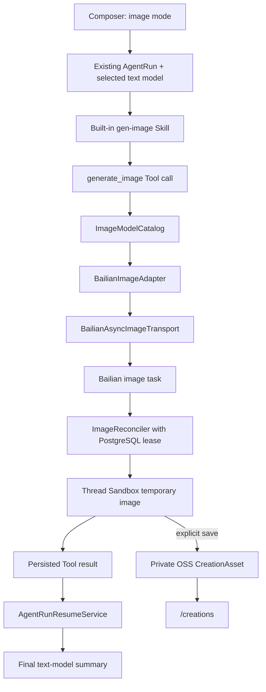

## Context

当前仓库已经具备持久 AgentThread/AgentRun、可恢复 SSE、Run-scoped Tool、内置 Skill、Thread Sandbox、Creation/CreationAsset、私有 OSS、RequestLog/BillingRecord 和“同一用户最多五个活动 Thread、同一 Thread 一个活动 Run”的准入能力。现有 ImageModule 则仍是早期独立 Mock API：Controller 固定选择 `mock-image`，状态刷新依赖客户端 GET，结果只保存上游 URL，与当前以 Agent 为唯一工作台的产品形态不一致。

本 change 经用户确认突破 `build-aigateway-v1` 的三项旧边界：真实图片 Provider、后台状态刷新和图像 C 端入口。部署仍保持单 ECS 模块化单体，不引入 BullMQ、独立 Worker、微服务或新的公网入口。外层编排必须继续使用现有 Agent Run 和当前文本模型；图像模型不承担 Function Calling，而由自动加载的内置 `gen-image` Skill 引导文本 Agent 调用 `generate_image` Tool。

阿里云百炼华北2（北京）是首个图片 Provider。四个首发平台模型为 Qwen Image、万相、可灵和 Vidu。平台内部统一为持久任务；根据当前官方协议，Qwen Image 2.0 Pro 使用同步多模态接口，万相、可灵和 Vidu 使用异步任务接口。生成结果先进入三小时 Thread Sandbox；只有用户显式保存才写入平台私有 OSS 并投影到 `/creations`。

## Goals / Non-Goals

**Goals:**

- 在 Composer 现有能力入口旁增加图像生成模式，保留当前文本模型作为 Agent 编排模型。
- 用仓库内置 `gen-image` Skill 和结构化 `generate_image` Tool 完成首次生成与基于上一张图的连续修改。
- 用版本化模型目录隔离平台模型 ID、展示能力、默认参数和百炼真实 model ID。
- 在 API 进程内可靠恢复百炼任务、Tool result 和等待中的 Agent Run，不依赖浏览器保持在线。
- 将临时图片限制在所属 Thread Sandbox，将用户明确保存的图片作为永久 CreationAsset 写入私有 OSS。
- 保持用户/Thread并发、取消、日志、计费、所有权和密钥去敏边界与现有 Agent一致。

**Non-Goals:**

- 不实现图片模型直接 Function Calling、独立 Image页面或 Composer图片模型选择器。
- 不实现一次多图、批量对比、图片模型自动 failover、版本历史或从 `/creations` 继续创作。
- 不实现作品删除、临时图片自动保存、Sandbox过期恢复或跨 Thread引用未保存图片。
- 不新增内容审核、单用户每日张数、全站成本硬顶或设备防刷；真实入口启用依赖项目外已完成的内容安全前置条件。
- 不接入火山引擎 Seedream，不新增真实模型 smoke CI脚本，不把真实 Key或外网调用放进普通 CI。

## Architecture

模块依赖保持单向：Agent编排依赖图片 Tool端口；Tool依赖图片目录和任务服务；百炼协议只存在 Adapter/Transport；Creation保存读取已经完成的 Sandbox资产，不让 Web或 Agent直接接触厂商 URL、OSS object key或密钥。

## Decisions

### Decision 1: 图像生成是现有 Agent Run mode

SDK为现有 Run请求增加 `mode: image`，Composer仍展示并提交文本模型。该模式按 Thread保留，直到用户主动退出；它不改变 Thread绑定的文本模型。服务端将 mode视为不可信输入，在 Run准入和工具组装时统一校验。

相比独立 Image API直连，这一选择允许 Agent理解“换成夜景”“改用可灵并打开水印”等自然语言，并在 Tool完成后说明实际模型、可替代模型和可调参数。相比新建 ImageRun体系，它直接复用消息、SSE、取消、并发和审计。

### Decision 2: `gen-image` 是自动激活的仓库内置 Skill

`gen-image` 使用标准 `SKILL.md` 和必要资源随仓库发布，启动时读取、校验并缓存；缺失或损坏时 API fail fast。每个 `image` Run在首次模型调用前自动安装/激活，正文与用户Prompt一起进入模型上下文，普通 Run不加载。动态模型列表、能力和默认值由 ImageModelCatalog在 Run时生成精简上下文，不硬编码进 Skill。

Skill要求 Agent优先调用 `generate_image`，未指定模型/参数时不反问，每个 Run最多调用一次，修改时默认引用当前创作链上一张仍有效图片，Tool完成后基于结构化能力提示用户下一步。Skill不能授予超出 Tool schema和服务端授权的能力。

### Decision 3: Tool接受平台语义，服务端解析可信执行参数

公开 Tool参数为 `prompt`、可选平台 `model`、可选 `referenceImageId`，以及 `aspectRatio/quality/watermark`。Tool不接受 provider、真实 model ID、count、任意 URL或路径。默认模型由`BAILIAN_IMAGE_DEFAULT_MODEL`配置（环境默认值为`qwen-image`），其余默认值为1:1、2K、一张、无水印；模型目录将平台质量/比例映射为各模型合法字段。

当用户基于上一张图继续时，Agent可传结构化图片标识；缺省时服务端只在当前创作链解析最近一张有效图片。所有权、Thread归属、Sandbox存活和路径边界由服务端验证。目标模型需要参考图时，API读取Sandbox字节并以内联Base64/data URL提交，绝不把本地路径或额外公网读取地址交给百炼。

### Decision 4: Tool result是对话中图片状态和操作的真源

Tool call创建并关联ImageGenerationTask。运行中Tool part显示提交、排队、生成和保存到Sandbox状态；成功result包含task/image标识、实际平台/上游模型、原始/有效Prompt、有效参数、受控预览/下载路径、Sandbox过期时间、替代模型和可调能力。Web用自定义Tool UI渲染，不从Agent Markdown提取图片URL。

Tool成功后恢复标准Agent工具循环，再调用一次文本模型生成简短总结和后续模型/参数提示。图片调用失败、取消或过期时，结构化Tool result保留错误，Agent不得自动切换图片模型或重复创建付费任务。

### Decision 5: 图片模型目录与百炼共享同步/异步Transport分离

版本化目录初始包含：

| 平台ID | 百炼model | 默认 |
| --- | --- | --- |
| `qwen-image` | `qwen-image-2.0-pro` | 是 |
| `wan-image` | `wan2.7-image-pro` | 否 |
| `kling-image` | `kling/kling-v3-image-generation` | 否 |
| `vidu-image` | `vidu/vidu-image_reference2image` | 否 |

每项声明文生图、参考图、比例、质量、水印和输入传输能力。model ID、启用状态、超时、轮询、价格占位和安全限制只能经代码评审发布；运行环境仅注入北京 Base URL 与 API Key。两项配置缺少任一项时隐藏入口并拒绝新图片 Run，不静默换模型。

四个mapper只处理请求/响应字段差异，共用Transport完成Bearer鉴权、配置的北京 Base URL、同步/异步分派、异步请求的`X-DashScope-Async: enable`、提交、查询、取消尝试、内置超时和错误归一化。生产registry不注册`mock-image`。

### Decision 6: PostgreSQL lease驱动Image Reconciler，不引入队列

提交前在一个事务内创建RequestLog、ImageGenerationTask和运行中的ToolCall关联；写库失败时禁止付费调用。提交获得providerTaskId后持久化；若上游可能已受理但task ID未可靠保存，则进入`SUBMISSION_UNKNOWN`且不自动重提。

API进程内Reconciler周期领取`nextPollAt <= now`且lease过期的任务，小批量查询并更新退避时间。状态归一化为PENDING、SUBMITTING、RUNNING、PERSISTING、SUCCEEDED、FAILED、CANCEL_REQUESTED、CANCELLED、EXPIRED和SUBMISSION_UNKNOWN。终态不可逆；相同provider/task ID唯一；事务用条件更新保证在线等待与Reconciler不会重复终结或重复计费。

成功结果必须先安全下载并写入仍存活的所属Thread Sandbox，之后才标记SUCCEEDED。下载校验允许域名、重定向、MIME/魔数、大小和超时。Sandbox已过期时任务进入EXPIRED并丢弃结果，不重新创建Sandbox。

### Decision 7: Agent Run可从持久Tool步骤恢复

Agent模型发出`generate_image`后，Tool调用、参数、图片任务和等待状态全部持久化。Reconciler完成Tool result后，AgentRunResumeService用独立PostgreSQL lease领取等待中的Run，重建assistant tool-call与tool-result历史，并执行最后一次文本模型调用。API重启时同一路径恢复；已有活动执行器通过条件状态转换阻止重复续跑。

取消立即终止页面读取并将Run/图片任务推进到CANCEL_REQUESTED；服务端best-effort调用上游取消。不能证明上游停止时，平台仍可标记CANCELLED并提示可能产生费用，但不得把取消描述为费用撤销。

### Decision 8: Sandbox是三小时临时资产边界

`SANDBOX_TIMEOUT_SECONDS`统一调整为10800。结果写入受控`/workspace/output/images`路径，消息只保存平台图片标识、受控路由和必要元数据。Sandbox过期后未保存图片的预览、下载和继续创作返回明确过期状态；Thread消息、日志和账单仍保留。

如果任务在Sandbox过期前尚未提交则CANCELLED；已提交且非终态则EXPIRED并best-effort取消；上游已成功但未落入Sandbox也进入EXPIRED。平台不通过本机容器磁盘或隐式OSS临时副本延长未保存图片寿命。

### Decision 9: 只有显式保存才创建永久CreationAsset

成功Tool UI分别提供本地下载和“保存到我的创作”。保存服务读取并校验当前Sandbox图片，先写新的私有OSS object，再在事务中幂等创建/更新IMAGE Creation和IMAGE CreationAsset；失败时清理新对象best-effort且不把消息标记为已保存。对象键不含Prompt，API只返回owner-scoped预览/下载路径。

保存资产永久保留，删除Thread不删除它；本期`/creations`仅展示和下载，不提供删除或继续创作。未保存图片不投影到`/creations`。

### Decision 10: 并发、计费和测试沿用已确认边界

图片生成占用普通AgentRun：同一Thread一个活动Run，同一用户最多五个活动Thread。一次Tool固定一张，不自动failover。RequestLog保存原始和有效Prompt、平台/上游模型、状态和错误；BillingRecord以成功图片数、版本化单价和人民币费用快照终结。

本change不增加每日张数和全站成本硬顶，默认水印关闭，这是用户明确接受的发布风险。内容安全视为真实入口启用前已满足的外部前置条件，但其实现不属于本change。

生产和开发不暴露Mock模型。单元、contract、集成和E2E通过去敏HTTP fixture/注入Transport离线执行，不访问外网。不开发表征为CI的真实模型smoke脚本；逐模型启用前人工执行最低成本请求并记录模型、地域、参数、结果、费用和关闭方法。

## Data Model

现有ImageGenerationTask继续作为图片任务真源，并向后兼容增加：AgentRun/ToolCall关联、父图片标识、原始/有效Prompt、平台参数、轮询/持久化attempt、nextPollAt、lease owner/expiry、Sandbox ID/path/expiry和取消/过期时间。provider与providerTaskId保持唯一。

Tool result使用现有Agent消息/事件持久化格式扩展`image-generation` artifact，不复制厂商URL。结果同时持久化按比例、质量和替代模型分类的后续建议，Web以气泡渲染，点击后通过assistant-ui Thread runtime直接append用户Prompt并启动正常Agent Run。永久保存继续使用Creation/CreationAsset；ImageGenerationTask可选关联Creation，但临时成功不自动创建Creation。Prisma迁移先增加可空字段和枚举值，再发布读取/写入代码，不依赖schema push。

## Failure Handling

| 失败 | 行为 |
| --- | --- |
| Run准入、限流或DTO失败 | 不创建图片任务，不调用百炼 |
| pending事务失败 | 503并fail closed |
| 提交明确失败 | FAILED，终结Run/日志/账单 |
| 提交结果不确定 | SUBMISSION_UNKNOWN，不自动重提 |
| 查询临时超时/429/5xx | 保留状态并退避重试 |
| 上游明确FAILED | FAILED并保留规范化错误 |
| 下载校验或写Sandbox失败 | 有界重试；Sandbox有效期内仍失败则FAILED |
| Sandbox过期 | EXPIRED，停止刷新并丢弃未保存结果 |
| API重启 | Reconciler与RunResumeService从PostgreSQL lease恢复 |
| 用户停止 | CANCEL_REQUESTED后best-effort取消，最终CANCELLED |
| OSS保存失败 | 临时图片仍可用，不创建错误Creation指针 |
| 最后文本总结失败 | 图片Tool result保留成功，Run以可重试总结错误终结，不重复生成图片 |

## Risks / Trade-offs

- [外层Agent增加一次或两次文本模型调用和延迟] → 复用用户当前模型；Tool完成后的总结保持简短，但不绕过Agent编排。
- [API内Reconciler在单实例停机时不工作] → 所有调度状态和lease落PostgreSQL，实例恢复后继续；本change接受单机无高可用。
- [Sandbox三小时后未保存图片永久丢失] → UI显示准确过期时间和保存入口，过期后保留可解释消息而不伪造恢复能力。
- [百炼不保证提交幂等] → 不确定提交不重试，避免重复付费；管理员可筛选SUBMISSION_UNKNOWN。
- [无每日/全站成本硬顶可能被多账号或并发Thread消耗额度] → 保留用户五活动Thread和现有限流，并使用低额度百炼账户；不宣称已解决成本防刷。
- [关闭水印带来生成内容标识风险] → 将实际模型和来源元数据写入数据库；公开发布合规由既有前置能力和发布验收负责。
- [无真实自动smoke可能较晚发现厂商协议漂移] → fixture覆盖已知协议；每次模型目录或mapper变更必须人工低成本验收并记录。

## Migration Plan

1. 新增向后兼容Prisma migration和离线fixture，部署时暂不配置两项百炼环境变量。
2. 发布图片目录、百炼Transport/mapper、任务状态机和Reconciler；旧Mock独立API暂不对用户开放。
3. 发布`gen-image` Skill、Tool、Run恢复和Web Tool UI，仍保持入口feature flag关闭。
4. 将Sandbox统一超时改为三小时，验证网页/文档/普通Agent现有能力不回归。
5. 配置北京 Base URL/API Key 和私有OSS，按Qwen Image、万相、可灵、Vidu顺序人工最低成本验收。
6. 验证外部内容安全前置条件后开放Composer入口；观察SUBMISSION_UNKNOWN、EXPIRED、费用和Sandbox资源。
7. 回滚时同时清空 Base URL/API Key，停止接收新Tool调用；Reconciler继续终结已提交任务。应用代码可回退，新增可空字段、历史日志、账单和已保存OSS资产保留。

## Open Questions

无。百炼账户实际 Base URL、API Key、人工验收日期和当期价格在发布阶段记录，不改变本设计。
