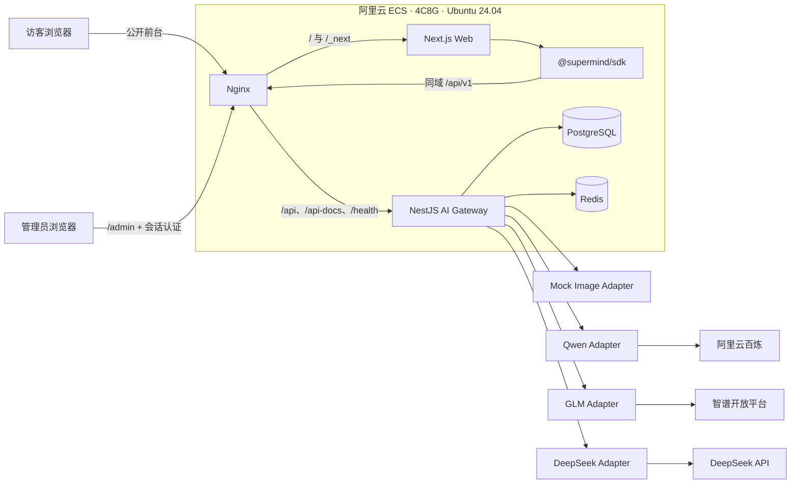
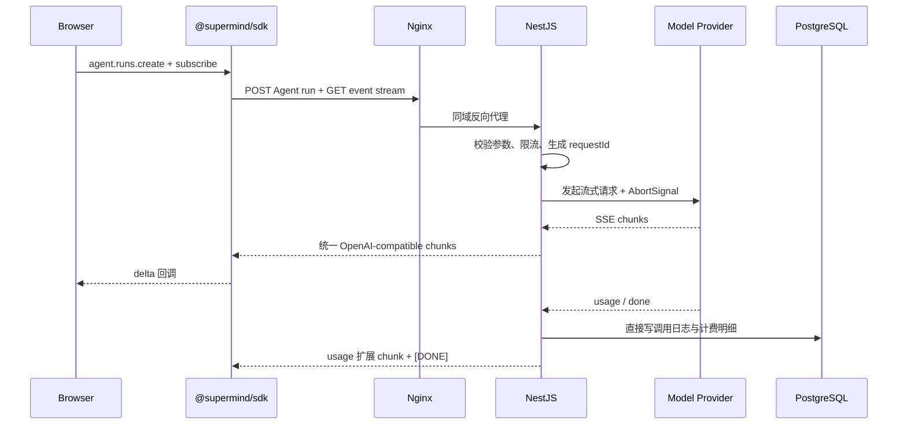

# Super Mind Studio · 技术选型与总体技术方案

> **2026-08-14 图像生成架构增量**：`integrate-agent-image-generation` change 覆盖本文旧 `MockImageAdapter` 和独立 Image API 方案。当前链路为“现有 AgentRun → 内置 `gen-image` Skill → `generate_image` Tool → 版本化 ImageModelCatalog → 百炼 Transport → PostgreSQL lease Reconciler → Thread Sandbox”。Qwen Image 2.0 Pro 按当前官方能力使用同步多模态接口，万相、可灵、Vidu 使用异步任务接口；平台统一持久为 ImageGenerationTask。临时图片三小时过期，只有显式保存才进入私有 OSS/CreationAsset。

> **产品定位**：AI 灵感创作平台  
> **底层模块**：Super Mind AI Gateway  
> **文档状态**：V1 方案  
> **依据文档**：`spec/需求文档.md`  
> **更新日期**：2026-07-28

---

## 一、方案目标

本方案服务于 V1 的核心目标：在 16 天开发周期内，完成一个可在阿里云 ECS 单机运行、可公开演示、可通过 Docker Compose 启动的国产多模型统一能力平台。

技术方案优先保证：

1. 四家文本模型的统一 thinking/text/tool/usage/finish 协议、取消与有限故障转移可真实运行
2. 用户前台以 Agent 对话为唯一工作台，Image/Prompt 保留为网关与 SDK 能力，并与管理后台日志、数据管理形成完整业务闭环
3. Web 强制通过单一 SDK 包 `@supermind/sdk` 调用网关
4. PostgreSQL、Redis、日志、计费和部署方案足够清晰，可直接指导编码
5. 不为尚未出现的规模问题提前引入微服务、消息队列或 Kubernetes

### 1.1 V1 明确不做

- 不使用 BullMQ 或独立 Worker
- 不拆分微服务
- 不使用 Vercel、Railway、RDS 或云 Redis
- 不实现访客注册登录、付费充值和长期会话记忆；管理后台实现单一管理员认证
- 不实现完整的成本防刷、内容审核和 Prompt 数据治理
- 不要求 `@supermind/sdk` 在 V1 发布到 npm
- 不接入 OpenAI、Anthropic Claude 和 Google Gemini，海外厂商在国内三家稳定后扩展

---

## 二、已确认的架构决策

| 决策项 | V1 结论 |
|--------|---------|
| 部署方式 | 阿里云 ECS 单机一体化部署 |
| 服务器 | 华东 1（杭州），4 vCPU / 8 GiB，Ubuntu Server 24.04 LTS 64 位 |
| 访问入口 | Nginx 同时支持公网 IP 和域名；域名、备案与 HTTPS 在部署联调阶段配置 |
| 页面边界 | 同一 Next.js 应用以登录保护的根 Agent 工作台为 C 端主界面，另含公开登录页和受保护的 `/admin` 管理后台 |
| 用户认证 | 一次性匿名登录 + GitHub/Google OAuth Authorization Code flow；NestJS 维护通用 `User` 与数据库 `UserSession`，使用 30 天固定有效期 HttpOnly Cookie |
| 管理员认证 | 暂时保持独立固定账号与短期会话 Cookie，不与用户 Session 混用 |
| 代码组织 | pnpm Monorepo |
| SDK | 单包 `@supermind/sdk`，目录为 `packages/sdk`，Web 使用 `workspace:*` |
| 数据库 | PostgreSQL 容器本地持久化 |
| 缓存 | Redis 仅用于限流和模型健康状态 |
| 异步队列 | V1 不使用 BullMQ，日志和计费直接写 PostgreSQL |
| Prompt 日志 | PostgreSQL 与 Pino 均保存完整 Prompt，V1 不自动清理；Dashboard 不展示 Prompt |
| 发布流程 | GitHub Actions 负责 CI；V1 采用人工 SSH 部署，不先做自动 CD |

---

## 三、总体架构



### 3.1 关键原则

- 浏览器不直接访问任何模型厂商，API Key 只存在于 NestJS 容器环境变量中
- Next.js 不承担网关职责，只负责页面渲染和浏览器交互
- Nginx 是唯一公网入口；NestJS、PostgreSQL、Redis 不映射公网端口
- Web 不能绕过 `@supermind/sdk` 直接调用网关
- 模型厂商差异全部封装在 Adapter 层，Controller 和 SDK 只使用平台统一类型
- 计费和日志在请求完成、失败或取消后直接落库，不引入队列

---

## 四、技术选型总表

### 4.1 基础运行时与工程工具

| 类别 | 选型 | 版本策略 | 选择理由 |
|------|------|----------|----------|
| 运行时 | Node.js | 24 LTS | 当前生产可用 LTS；Web、API、SDK 统一运行时 |
| 语言 | TypeScript | 5.9.x | 与 Prisma 7 推荐版本一致，开启 strict |
| 包管理 | pnpm | 10.x | Workspace、依赖去重和磁盘占用适合 Monorepo |
| 模块规范 | ESM | 全仓统一 | Prisma 7 原生 ESM；避免 API 内部混用 CJS/ESM |
| 代码规范 | ESLint + Prettier | 锁定主版本 | Next.js 16 不再在 build 时自动执行 lint，CI 单独执行 |
| Git Hooks | 暂不引入 | V1 后置 | 避免首版工具链过重，质量由 CI 保证 |

Node.js 26 在当前日期仍属于 Current，生产环境选择 Node.js 24 LTS。Next.js 16 要求 Node.js 20.9 以上，NestJS 11 要求 Node.js 20 以上，因此 Node.js 24 可以同时覆盖前后端要求。

### 4.2 前端选型

| 类别 | 选型 | 版本 | 选择理由 |
|------|------|------|----------|
| 框架 | Next.js App Router | 16.x | 满足 PRD，支持 React Server Components、Turbopack 和 standalone 输出 |
| UI 运行时 | React | 19.x | 与 Next.js 16 配套 |
| 样式 | Tailwind CSS | 4.x | CSS-first 配置、构建快、与 shadcn/ui 配套 |
| 组件 | shadcn/ui | CLI 锁定生成时版本 | 源码进入仓库，可自行调整，不引入黑盒组件库 |
| 客户端状态 | Zustand | 5.x | 适合会话、模型选择、生成状态等轻量状态 |
| 主题 | next-themes | 当前稳定版 | 亮色/暗色主题切换 |
| 图表 | Apache ECharts | 6.x | 满足 Dashboard 折线图、柱状图需求 |
| 数据表格 | TanStack Table | 8.x | 管理后台分页、排序、筛选和列控制 |
| Markdown | react-markdown + remark-gfm | 当前稳定版 | 安全渲染模型回答，不直接使用 `dangerouslySetInnerHTML` |
| SSE 解析 | eventsource-parser | 当前稳定版 | `EventSource` 不支持 POST，使用 Fetch 流 + SSE parser |
| 图标 | lucide-react | 与 shadcn/ui 配套 | 风格统一、按需引用 |

不引入 Redux、TanStack Query 或完整表单框架。V1 的服务端状态较少，Chat 流和文生图轮询均由 SDK 驱动，Zustand 加组件局部状态足够。

### 4.3 SDK 选型

| 类别 | 选型 | 说明 |
|------|------|------|
| 包名 | `@supermind/sdk` | 唯一 SDK 包，不拆成三个 npm 包 |
| 目录 | `packages/sdk` | pnpm workspace 包 |
| 构建 | tsup | 输出 ESM、CJS 和 `.d.ts` |
| HTTP | 原生 Fetch | 浏览器和 Node.js 24 均可使用 |
| 流解析 | eventsource-parser | 解析 POST SSE 响应 |
| V1 使用方式 | `workspace:*` | 不依赖 npm scope 发布权限 |

SDK 对外接口：

```ts
const client = new SuperMindClient({ baseURL: '/api/v1' })

client.agent.threads.create(request)
client.agent.runs.create(threadId, request)
client.agent.runs.subscribe(runId, { signal, after })
client.image.generate(request)
client.image.getTask(taskId)
client.image.download(taskId, imageIndex)
client.prompt.optimize(request)
client.admin.auth.login(credentials)
client.admin.dashboard.getOverview()
client.admin.logs.list(query)
client.admin.tables.list()
client.admin.tables.update(table, id, patch)
client.admin.tables.delete(table, id)
```

SDK 负责：

- 请求和响应类型
- SSE 帧解析
- AbortSignal 传递
- 统一错误对象
- 文生图提交与轮询封装
- usage、人民币费用和 failover 元数据解析
- 管理员登录、日志查询和白名单业务表 CRUD 请求封装

SDK 不负责：

- 保存厂商 API Key
- 直接调用厂商接口
- 页面状态和 UI 提示
- 业务日志落库

### 4.4 后端选型

| 类别 | 选型 | 版本 | 选择理由 |
|------|------|------|----------|
| 框架 | NestJS | 11.x | 模块化、依赖注入、Swagger 和测试生态完整 |
| HTTP Adapter | Express | NestJS 默认 | V1 低并发，优先降低 SSE、取消和中间件集成成本，不使用 Fastify |
| 参数校验 | class-validator + class-transformer | 与 Nest 配套 | DTO、Swagger 注解和运行时校验路径最短 |
| 配置 | `@nestjs/config` + 启动校验 | 与 Nest 配套 | 环境变量集中管理，启动时暴露缺失配置 |
| API 文档 | `@nestjs/swagger` | 与 Nest 11 配套 | 自动生成 `/api-docs` |
| 日志 | Pino + nestjs-pino | 当前稳定版 | JSON 结构化日志、低开销、requestId 贯穿 |
| 缓存客户端 | node-redis | 5.x | Redis 官方 Node.js 客户端，不使用 ioredis |
| 调度 | `@nestjs/schedule` | 与 Nest 配套 | 执行 60 秒轻量健康探测 |
| 安全头 | helmet | 当前稳定版 | 提供基础 HTTP 安全头 |
| 管理员认证 | `@nestjs/jwt` + cookie-parser | 当前稳定版 | 校验 V1 固定管理员凭证并签发 HttpOnly Cookie 会话；暂不引入用户表和密码哈希组件 |
| 厂商调用 | 原生 Fetch | Node.js 24 内置 | 流、超时和 AbortController 控制直接，无需引入三套厂商 SDK |

### 4.5 数据与基础设施选型

| 类别 | 选型 | 版本 | 选择理由 |
|------|------|------|----------|
| 关系数据库 | PostgreSQL | 17.x | 版本成熟且官方支持到 2029；不追最新 18，降低单机首版风险 |
| ORM | Prisma | 7.x | 类型安全、迁移清晰；使用 ESM 和新 `prisma-client` generator |
| 缓存 | Redis Open Source | 8.x | 仅使用 String、Hash、TTL 和 Lua；实现限流与健康状态 |
| Redis 客户端 | node-redis | 5.x | 官方推荐客户端 |
| 反向代理 | Nginx | stable | IP/域名入口、TLS、SSE 代理、静态与 API 路由 |
| 容器运行时 | Docker Engine | 24+ | 满足 PRD 与 Ubuntu 24.04 |
| 容器编排 | Docker Compose | v2 | 单机部署足够，不使用 Kubernetes |
| CI | GitHub Actions | Ubuntu Runner | lint、typecheck、test、build |

PostgreSQL 18 是当前最新正式版，但 V1 选择 17：功能完全满足、生态成熟，并仍处于长期支持周期。Redis 只保存可重建数据，V1 关闭 AOF/RDB，不做 Redis 备份。

---

## 五、Monorepo 目录设计

```text
super-mind-studio/
├── apps/
│   ├── web/                       # Next.js 16
│   │   ├── src/app/
│   │   ├── src/components/
│   │   ├── src/features/
│   │   └── src/stores/
│   └── api/                       # NestJS 11
│       ├── src/modules/
│       ├── src/common/
│       ├── src/config/
│       ├── prisma/
│       │   ├── schema.prisma
│       │   └── migrations/
│       └── test/
├── packages/
│   └── sdk/                       # @supermind/sdk
│       ├── src/chat/
│       ├── src/image/
│       ├── src/prompt/
│       ├── src/dashboard/
│       └── src/types/
├── infra/
│   └── nginx/
│       ├── nginx.conf
│       └── conf.d/aigateway.conf
├── spec/
├── compose.yaml                   # 完整单机运行栈
├── compose.dev.yaml               # 本地仅启动 PostgreSQL/Redis 等依赖
├── pnpm-workspace.yaml
├── package.json
├── pnpm-lock.yaml
├── .env.example
└── .github/workflows/ci.yml
```

只建立一个业务共享包 `@supermind/sdk`。ESLint、TypeScript 等配置先放仓库根目录，不为了“共享配置”额外制造多个 workspace 包。

---

## 六、前端方案

### 6.1 页面路由

| 路由 | 页面 | 渲染策略 |
|------|------|----------|
| `/` | 普通对话、持久会话与多步 Agent 任务 | Client Component，登录保护并消费持久 run/event 流 |
| `/chat` | 旧普通 Chat 兼容入口 | Server Component，临时跳转到 `/` |
| `/admin/login` | 管理员登录 | Client Component，登录成功后进入后台 |
| `/admin` | 管理后台首页 | Server Layout + Client 数据组件 |
| `/admin/dashboard` | 监控仪表盘 | 图表 Client Component |
| `/admin/logs` | 请求日志 | TanStack Table + 日志详情抽屉 |
| `/admin/database` | 白名单业务表管理 | 表选择、分页、编辑弹窗和删除确认 |
| `/admin/audit` | 管理员操作审计 | 只读列表和详情 |

### 6.2 状态边界

页面状态保存：

- Agent 当前 thread、运行状态和事件由 assistant-ui runtime 与服务端持久数据共同驱动
- 主题以外的少量用户偏好可使用 Zustand 或组件局部状态

组件局部状态保存：

- 单个弹窗和复制提示
- Dashboard 查询加载状态

C 端不再读取或写入文生图历史 localStorage；已有历史键不主动迁移或清理。

### 6.3 用户前台与管理后台边界

用户前台包括公开的 `/login`，以及通用 User Session 保护的根 Agent 工作台 `/`，不包含调用日志、数据库记录或管理入口数据。`/chat` 仅作为旧链接跳转到 `/`；`/chat/compare`、`/agent`、`/image`、`/prompt` 和 C 端 `/api` 展示页不注册路由并直接返回 404。Image/Prompt API、同源 `/api/v1/*` 网关、Swagger、SDK、数据与管理能力仍保留。NestJS API 是用户认证真源，并对付费 API 校验数据库 Session。

管理后台的数据表不是通用数据库客户端：

- 前端只渲染后端返回的白名单表定义
- 后端把表标识映射到固定 Prisma Repository，禁止把用户输入拼接成 SQL、表名或列名
- 每张表单独声明可查看、可编辑、可删除字段
- `id`、`requestId`、关联键、创建时间等不可编辑
- 修改和删除必须二次确认，删除 RequestLog 时由事务处理关联 BillingRecord
- `AdminAuditLog` 只读，不允许在后台编辑或删除

### 6.4 单管理员认证

管理后台不建立独立管理员表、角色和权限模型。为快速跑通管理后台，NestJS 服务端暂时使用固定凭证；该认证与用户端匿名/OAuth、`User` 和 `UserSession` 完全隔离：

```text
username: root
password: 123456
```

会话相关配置仍通过环境变量提供：

```text
ADMIN_SESSION_SECRET
ADMIN_SESSION_TTL
ADMIN_COOKIE_SECURE
```

- 固定账号和密码只在 NestJS 服务端校验，不能写入浏览器代码或由登录接口返回
- 登录成功后签发短期会话并写入 HttpOnly、SameSite=Strict Cookie
- 生产域名启用 HTTPS 后 Cookie 必须设置 Secure
- 使用公网 IP 进行 HTTP 联调时，只允许在开发环境关闭 Secure
- 登录接口单独限流，默认同 IP 5 次/分钟
- PATCH、DELETE 管理请求校验 Origin，并携带 CSRF Token
- 退出登录立即清除 Cookie；修改会话密钥后旧会话全部失效
- 因仓库最终公开且后台具备完整 Prompt 查看与数据删除能力，`root / 123456` 只能用于开发联调，正式公开前必须替换为环境变量密码哈希或外部身份认证

### 6.5 Markdown 安全

- 使用 `react-markdown` 渲染，不使用原始 HTML
- V1 不启用 `rehype-raw`
- 链接默认增加 `rel="noopener noreferrer"`
- 代码块高亮可在主流程完成后增加，不作为核心依赖

---

## 七、后端模块设计

```text
AppModule
├── ConfigModule
├── PrismaModule
├── RedisModule
├── LoggingModule
├── AdminAuthModule
├── AdminModule
├── RateLimitModule
├── ProviderModule
│   ├── QwenChatAdapter
│   ├── GlmChatAdapter
│   ├── DeepSeekChatAdapter
│   └── MockImageAdapter
├── ModelGatewayModule
├── ImageModule
├── PromptModule
├── BillingModule
├── HealthModule
└── DashboardModule
```

### 7.1 Adapter 接口

```ts
interface ChatProviderAdapter {
  readonly provider: ProviderId
  stream(request: ProviderChatRequest, signal: AbortSignal): AsyncIterable<ProviderChunk>
  probe(): Promise<ProviderHealthResult>
}

interface ImageProviderAdapter {
  readonly provider: 'mock'
  submit(request: ProviderImageRequest): Promise<ProviderImageTask>
  getTask(providerTaskId: string): Promise<ProviderImageTaskResult>
}
```

Adapter 负责模型名、请求字段、鉴权、错误码、SSE chunk、usage 和图片状态映射。业务 Service 不出现厂商响应类型。

### 7.2 厂商 HTTP 策略

三家 Chat API 均提供 OpenAI 兼容或高度兼容的 Chat Completions 接口，因此实现一个内部 `OpenAICompatibleChatTransport` 处理通用 HTTP/SSE，再由三个 Adapter 处理各家的：

- base URL 与鉴权
- 模型名
- usage 字段差异
- reasoning_content 等扩展字段
- 错误码与重试条件
- 健康探测方式

V1 文生图仅通过 `MockImageAdapter` 验证统一任务协议，不接入真实图片 Provider。

### 7.3 稳定模型别名

平台 API 不直接暴露易变化的厂商 model id，使用稳定别名：

| 平台别名 | 厂商 | 实际模型配置 |
|----------|------|--------------|
| `qwen` | 阿里云百炼 | `QWEN_CHAT_MODEL`，初始候选 `qwen-plus` |
| `glm` | 智谱 | `GLM_CHAT_MODEL`，购买 Key 时按当前可用模型确定 |
| `deepseek` | DeepSeek | `DEEPSEEK_CHAT_MODEL`，初始候选 `deepseek-v4-flash` |
| `mock-image` | 平台 Mock | 固定 `mock-image-v1` |

`deepseek-chat` 官方已宣布于 2026-07-24 弃用，因此不能再把它写死在平台公开契约中。实际模型 ID、单价和生效日期由集中配置维护。

### 7.4 API Key 尚未购买时

- 缺少某厂商 Key 不阻止 NestJS 启动
- 对应 Provider 状态标记为 `unconfigured`
- 调用该模型返回统一错误 `MODEL_NOT_CONFIGURED`
- dev/test 提供确定性的 Mock Adapter，生产环境默认禁用
- CI 只使用 Mock Adapter，不依赖真实余额和网络

### 7.5 海外厂商扩展边界

V1 的 Adapter Registry 只注册 Qwen、GLM、DeepSeek。后续按相同接口逐步注册 OpenAI、Anthropic Claude 和 Google Gemini：

```text
ProviderRegistry
├── qwen          # V1
├── glm           # V1
├── deepseek      # V1
├── openai        # 后续版本
├── claude        # 后续版本
└── gemini        # 后续版本
```

扩展海外模型时，Web 和 `@supermind/sdk` 仍只处理平台统一的 message、delta、usage、error 和 done 事件。新增工作限定在：

- Provider Adapter 与配置项
- 模型能力矩阵
- 美元价格、汇率及缓存 Token 等计费规则
- 海外网络、超时、账号支付和合规验证
- Adapter 契约测试和真实厂商冒烟测试

不允许为了兼容某个海外厂商，把其私有响应结构直接暴露到 Controller、SDK 或 Web。

---

## 八、Chat 流式链路

### 8.1 请求时序



### 8.2 Agent 可恢复事件流

厂商的 OpenAI-compatible SSE 只存在于 Adapter 内部。Adapter 将 `reasoning_content`、正文、工具调用和 usage 规范化，Agent run 将其持久化为带序号的事件；浏览器通过 `GET /api/v1/agent/runs/:runId/events` 订阅，断线时使用游标补读，并以唯一 `[DONE]` 结束。

### 8.3 故障转移边界

- 仅 Agent 的单次模型调用允许 failover
- 仅在尚未产生第一个 reasoning、text 或 tool 事件前切换
- 触发条件：连接超时、明确 5xx、网络错误或 Provider 被判定不可用
- 4xx 参数错误、内容过滤、余额不足不自动切换
- 流已开始后发生错误，不拼接备用模型内容；持久化规范化失败终态并结束

### 8.4 取消

- SDK 将浏览器 AbortSignal 传给 Fetch
- NestJS 监听请求 `close`/`aborted`
- 网关 AbortController 传递给厂商 Fetch
- 取消后保留已输出内容，并记录 `status=cancelled`
- 厂商是否立即停止计算和计费属于尽力而为

### 8.5 Token 与计费

- 请求厂商时启用其流式 usage 选项，例如 `stream_options.include_usage=true`
- 只有能在 V1 实际返回 usage 的模型配置才通过计费验收
- Chat 成本按输入/输出 Token 分开计算
- 金额使用 Decimal，不使用 JavaScript 浮点数累计
- 价格配置单位统一为“元 / 100 万 Token”，并记录价格版本和生效日期
- 文生图按成功图片张数 × 单价计算

---

## 九、文生图方案

### 9.1 统一任务模型

网关统一暴露提交和轮询接口：

```text
POST /api/v1/images/generations
GET  /api/v1/images/generations/:taskId
GET  /api/v1/images/generations/:taskId/images/:index/download
```

- 只选用厂商支持的异步任务接口
- `taskId` 是平台自己的 ID，不直接暴露厂商 task id
- 平台任务与厂商 task id 的映射写入 PostgreSQL
- 前端通过 SDK 轮询，初始间隔 2 秒，逐步增加到 5 秒
- 任务超过配置的最大等待时间后停止前端轮询，但保留继续查询能力

### 9.2 下载代理

下载接口只允许下载已经记录在该任务结果中的 URL，不能接收任意外部 URL 参数，避免形成 SSRF 代理。

上游图片 URL 可能带签名并过期。V1 不引入 OSS 永久转存，localStorage 历史记录可能在 URL 过期后失效；这属于已知边界。

---

## 十、Prompt 优化方案

Prompt 优化不单独接第三方服务，复用 Chat Provider：

- `expand`：增加背景、目标、受众、输出要求和约束
- `concise`：删除重复和模糊信息，保留核心目标
- `structured`：整理为角色、任务、上下文、约束、输出格式

服务端维护三套版本化模板，客户端只传原 Prompt 和 mode，不能传任意 system prompt。默认模型通过 `PROMPT_OPTIMIZER_MODEL` 配置。

接口为非流式：

```text
POST /api/v1/prompts/optimize
```

---

## 十一、API 设计

### 11.1 核心接口

| 方法 | 路径 | 说明 |
|------|------|------|
| GET | `/api/v1/agent/runs/:runId/events` | 可恢复 Agent SSE 事件流 |
| POST | `/api/v1/images/generations` | 创建文生图任务 |
| GET | `/api/v1/images/generations/:taskId` | 查询文生图状态 |
| GET | `/api/v1/images/generations/:taskId/images/:index/download` | 代理下载图片 |
| POST | `/api/v1/prompts/optimize` | Prompt 优化 |
| GET | `/api/v1/models` | 模型列表与健康状态 |
| POST | `/api/v1/admin/auth/login` | 管理员登录并设置会话 Cookie |
| POST | `/api/v1/admin/auth/logout` | 管理员退出登录 |
| GET | `/api/v1/admin/auth/session` | 查询当前管理员会话 |
| GET | `/api/v1/admin/dashboard/overview` | 今日概览 |
| GET | `/api/v1/admin/dashboard/trends` | 24 小时趋势 |
| GET | `/api/v1/admin/dashboard/latencies` | 模型延迟统计 |
| GET | `/api/v1/admin/dashboard/errors` | 最近错误 |
| GET | `/api/v1/admin/logs` | 分页、筛选请求日志 |
| GET | `/api/v1/admin/logs/:requestId` | 查看包含完整 Prompt 的日志详情 |
| GET | `/api/v1/admin/tables` | 返回白名单业务表和字段能力定义 |
| GET | `/api/v1/admin/tables/:table/rows` | 查询白名单业务表记录 |
| PATCH | `/api/v1/admin/tables/:table/rows/:id` | 修改允许编辑的字段 |
| DELETE | `/api/v1/admin/tables/:table/rows/:id` | 删除允许删除的记录 |
| GET | `/api/v1/admin/audit-logs` | 查询只读管理员操作审计 |
| GET | `/health/live` | 进程存活检查 |
| GET | `/health/ready` | PostgreSQL、Redis 就绪检查 |
| GET | `/api-docs` | Swagger UI |

### 11.2 普通 JSON 错误

```json
{
  "code": "RATE_LIMITED",
  "message": "请求过于频繁，请稍后重试",
  "requestId": "req_xxx",
  "retryAfter": 42
}
```

生产响应不返回堆栈和厂商原始错误；完整错误写 Pino 和 PostgreSQL。

### 11.3 输入边界

| 参数 | V1 限制 |
|------|---------|
| messages | 1～50 条 |
| 单条 content | 默认最多 20,000 字符，可配置 |
| temperature | 0～2 |
| top_p | 0～1 |
| max_tokens | 1～4096 |
| 图片数量 | 1～4 |
| 请求体 | Nginx 与 NestJS 双重限制，默认 1 MiB |

---

## 十二、数据库设计

### 12.1 选型结论

- PostgreSQL 17
- Prisma 7
- 应用统一使用 UTC 入库，Dashboard 按 Asia/Shanghai 展示和聚合
- 金额使用 `DECIMAL(18, 8)`
- Token 使用 `INTEGER`，累计查询使用 `BIGINT` 转换
- ID 使用 UUID，requestId 单独建立唯一索引

### 12.2 核心实体

#### `RequestLog`

| 字段 | 说明 |
|------|------|
| id / requestId | 主键与外部追踪 ID |
| feature | chat / image / prompt |
| requestedModel / actualModel | 用户选择与实际调用模型 |
| prompt | 完整 Prompt 或 messages 序列化内容 |
| clientIp | Nginx 解析后的客户端 IP |
| status | pending / succeeded / failed / cancelled |
| promptTokens / completionTokens / totalTokens | Token 用量 |
| latencyMs / ttfbMs | 总耗时与首字节耗时 |
| failoverFrom | 故障转移来源模型 |
| errorCode / errorMessage | 统一错误码与完整错误信息 |
| createdAt / completedAt | 时间字段 |

索引：`requestId unique`、`createdAt`、`actualModel + createdAt`、`status + createdAt`。

#### `BillingRecord`

| 字段 | 说明 |
|------|------|
| id / requestId | 主键及与 RequestLog 的一对一关联 |
| provider / model | 厂商和实际模型 |
| billingType | token / image |
| inputUnits / outputUnits | 输入、输出 Token 或图片数量 |
| inputUnitPrice / outputUnitPrice | 本次使用的价格快照 |
| costCny | 本次费用 |
| priceVersion | 价格配置版本 |
| estimated | 是否估算；V1 验收场景要求 false |

#### `ImageGenerationTask`

| 字段 | 说明 |
|------|------|
| id | 平台 taskId |
| provider / model | 图片厂商和模型 |
| providerTaskId | 厂商任务 ID |
| prompt / size / count | 完整请求参数 |
| status | pending / running / succeeded / failed |
| resultUrls | JSON 数组 |
| errorCode / errorMessage | 失败信息 |
| costCny | 按张计费 |
| createdAt / completedAt | 时间字段 |

#### `AdminAuditLog`

| 字段 | 说明 |
|------|------|
| id | 审计记录 ID |
| adminUsername | 执行操作的管理员 |
| action | update / delete |
| tableName / recordId | 被操作的白名单表和记录 |
| beforeData / afterData | 变更前后 JSON 快照；删除时 afterData 为空 |
| requestId / clientIp | 管理请求追踪信息 |
| createdAt | 操作时间 |

该表不与被删除记录建立强外键，避免业务记录删除时连带丢失审计快照。管理后台只允许查询，不提供修改或删除接口。

### 12.3 写入时机

1. 请求通过校验和限流后创建 `RequestLog(status=pending)`
2. 流结束、失败或取消后更新 RequestLog
3. 同一数据库事务中 upsert BillingRecord
4. 数据库写入失败不篡改已经发送给用户的模型内容，但必须输出 error 日志并计入健康检查
5. 管理员修改或删除业务数据时，在同一事务内完成业务变更和 AdminAuditLog 写入

V1 没有自动清理任务，完整 Prompt 和调用数据持续保留。该策略只适用于当前开发阶段。

---

## 十三、Redis 设计

Redis 保存可重建的短期状态，不保存业务事实数据。

### 13.1 Key 设计

```text
rate:chat:{ip}:{yyyyMMddHHmm}      -> count，TTL 60～120s
rate:image:{ip}:{yyyyMMddHHmm}     -> count，TTL 60～120s
provider:health:{provider}         -> JSON status，独立 TTL 300s
```

### 13.2 限流

- 使用 Lua 将 `INCR` 和首次 `EXPIRE` 原子化
- Chat 与 Image 使用独立计数器
- Nginx 只向 API 传可信的 `X-Real-IP`，API 容器不开放公网端口
- Redis 不可用时，V1 返回服务不可用，不绕过限流继续调用付费模型

### 13.3 持久化

关闭 AOF 和 RDB。Redis 重启后限流计数和健康状态重置可以接受；Provider 会通过后续请求和主动探测重新建立状态。每个 Provider 使用独立健康 key，避免某个活跃 Provider 刷新共享 TTL 时延长其他 Provider 的陈旧状态。

---

## 十四、健康检查与故障转移

### 14.1 被动健康检查

每次真实调用记录：

- 最近成功/失败时间
- 连续失败次数
- 滚动延迟
- 错误类型

连续网络错误、超时或 5xx 达到阈值后标记 unhealthy；业务 4xx 不影响健康状态。

### 14.2 主动探测

每 60 秒执行一次：

- 优先调用厂商 models/list 或其他不产生推理费用的轻量端点
- 厂商无免费探测端点时，只检查网络和鉴权，不发起内容生成
- 主动探测只用于恢复状态和 Dashboard 展示，不覆盖实时请求结果

---

## 十五、日志与可观测性

### 15.1 Pino 日志字段

```text
timestamp, level, requestId, feature, provider, requestedModel,
actualModel, clientIp, prompt, status, promptTokens,
completionTokens, costCny, ttfbMs, latencyMs, error
```

按照已确认的 V1 决策，Pino 和 PostgreSQL 均保存完整 Prompt。聚合 Dashboard 不返回 Prompt；只有通过管理员认证的日志详情接口可以读取完整 Prompt。

### 15.2 Docker 日志轮转

每个容器配置：

```yaml
logging:
  driver: json-file
  options:
    max-size: 20m
    max-file: "5"
```

避免完整 Prompt 和流式日志持续占满系统盘。

### 15.3 Dashboard 聚合

- 今日概览：按 Asia/Shanghai 自然日过滤
- 24 小时趋势：PostgreSQL `date_trunc('hour', ...)`
- 延迟：`avg`、`percentile_cont(0.95)`、样本数
- 最近错误：只返回统一错误码、脱敏展示文案、模型和 requestId
- V1 直接查询原始表；数据量明显增加后再考虑小时聚合表

---

## 十六、Nginx 与单机部署

### 16.1 Compose 服务

| 服务 | 对外端口 | 建议内存上限 | 持久化 |
|------|----------|--------------|--------|
| nginx | 80 / 443 | 128 MiB | 配置和证书 |
| web | 不暴露 | 1 GiB | 无 |
| api | 不暴露 | 1.5 GiB | 无 |
| postgres | 不暴露 | 2 GiB | named volume |
| redis | 不暴露 | 256 MiB | 无 |

其余内存留给 Ubuntu、文件缓存、Docker 构建和突发使用。生产镜像采用 multi-stage build；Next.js 使用 `output: 'standalone'` 减小运行镜像。

### 16.2 启动顺序

- PostgreSQL、Redis 配置 healthcheck
- migration 容器执行 `prisma migrate deploy` 并成功退出
- API 等待 PostgreSQL、Redis 和 migration 完成
- Web 启动不依赖模型厂商可用
- Nginx 等待 Web 与 API 健康
- 所有常驻服务使用 `restart: unless-stopped`

### 16.3 Nginx 路由

```text
/api/v1/*   -> api:3001
/api-docs*  -> api:3001
/health/*   -> api:3001
/*          -> web:3000
```

Chat SSE 路由必须：

```nginx
proxy_http_version 1.1;
proxy_buffering off;
proxy_cache off;
proxy_read_timeout 300s;
proxy_send_timeout 300s;
```

NestJS 同时返回 `X-Accel-Buffering: no`。

### 16.4 IP 与域名

- Nginx 默认 server 接受公网 IP
- 域名 A 记录指向同一公网 IP 后，增加域名 server_name
- 完成 ICP 备案和 DNS 后再签发并启用 HTTPS 证书
- HTTP 可用于首轮联调；正式公开演示使用 HTTPS

### 16.5 数据备份

- PostgreSQL 每日 `pg_dump`，本机保留最近 7 份
- 部署数据库迁移前额外执行一次备份
- Redis 无业务持久数据，不备份
- V1 不实现跨机容灾，单机故障恢复依赖 Compose、源码和 PostgreSQL 备份

---

## 十七、安全边界

V1 必须实现的基础安全：

- API Key 只写入服务器 `.env`，文件权限 `600`，不进入 Git 和镜像
- PostgreSQL、Redis、Web、API 均只加入 Docker 内部网络
- 阿里云安全组只开放 22、80、443；SSH 使用密钥
- Nginx 设置请求体大小和基础连接超时
- NestJS 使用 DTO 白名单校验，拒绝未知字段
- 使用 Helmet；生产错误不返回堆栈
- 图片下载代理只接受平台 taskId 和图片 index
- Swagger 可公开用于作品展示，但不显示环境变量和敏感示例
- `/admin` 页面和 `/api/v1/admin/*` 强制单管理员认证
- 管理表名、字段名和操作类型使用后端白名单，不接受任意 SQL 或任意 Prisma delegate
- 所有管理修改和删除都在事务中写入不可变 AdminAuditLog
- 管理 Cookie 使用 HttpOnly、SameSite=Strict；生产环境使用 Secure，并对写操作增加 CSRF 校验

V1 已知但延后的安全问题：

- 全站人民币预算硬顶和防刷
- 输入/输出内容审核
- Prompt 脱敏、访问分级、保留期限和删除机制

这些延后项不应被描述成“已具备生产合规能力”。

---

## 十八、测试与 CI

### 18.1 测试分层

| 层级 | 工具 | 覆盖范围 |
|------|------|----------|
| 单元测试 | Jest | Adapter 协议转换、计费、failover、限流 Lua 调用封装 |
| API 集成测试 | Jest + Supertest/原生 Fetch | DTO、PostgreSQL、Redis、错误格式 |
| 流式 E2E | 原生 Fetch + Mock Adapter | SSE delta、usage、`[DONE]`、取消 |
| Web 冒烟 | Playwright | Chat 流式展示、停止生成、管理员登录、日志查询和删除确认 |
| 管理 API | Jest + Supertest | 固定管理员登录、未登录拒绝、表/字段白名单、事务删除和审计记录 |
| 厂商冒烟 | 独立手动脚本 | 三家真实 Key 的流式 usage 和图片任务 |

真实厂商测试不在普通 CI 中执行，避免消耗额度和受外部网络波动影响。

### 18.2 GitHub Actions

```text
pnpm install --frozen-lockfile
pnpm lint
pnpm typecheck
pnpm test
pnpm build
pnpm test:e2e:stream
```

CI 使用 PostgreSQL、Redis service container 和 Mock Provider。V1 不配置自动部署，线上更新流程为人工 SSH、拉取代码、备份、构建并执行 `docker compose up -d`。

---

## 十九、实施顺序

### Phase 0：基础工程

1. 初始化 pnpm workspace、Node 24、TypeScript 5.9
2. 创建 `apps/web`、`apps/api`、`packages/sdk`
3. 创建 PostgreSQL、Redis、Nginx 与 Compose
4. 接入 Prisma migration、Pino、healthcheck

### Phase 1：网关闭环

1. 定义统一 Chat 类型和 Mock Adapter
2. 跑通 Agent thread/run/可恢复 SSE、取消、日志和计费
3. 实现 Redis IP 限流
4. 依次接入 Qwen、GLM、DeepSeek、Kimi，并显式配置 thinking
5. 实现首个 reasoning/text/tool 事件前 failover

### Phase 2：SDK 与 Web 对话

1. 完成 `@supermind/sdk`
2. Web 通过 `workspace:*` 使用 SDK
3. 通过根路径 `/` 完成普通对话、持久会话、多步工具任务、停止和错误态

### Phase 3：Image 与 Prompt 网关能力

1. 增加 ImageGenerationTask
2. 实现 Mock Image 异步任务闭环
3. 完成 SDK 轮询与下载代理，不建设独立 C 端画廊
4. 完成三种 Prompt 优化模板与 SDK 封装，不建设独立 C 端页面

### Phase 4：管理后台、Dashboard 与部署

1. 完成单管理员登录、会话 Guard 和 CSRF 防护
2. 完成请求日志、白名单业务表 CRUD 与 AdminAuditLog
3. 完成 PostgreSQL 聚合查询与 ECharts
4. 完成 Docker 资源限制、Nginx SSE 配置和日志轮转
5. ECS 上通过公网 IP 联调
6. 配置域名、备案与 HTTPS

---

## 二十、编码前仍需确认的外部事项

以下事项不阻塞项目脚手架和 Mock 闭环，但会阻塞真实厂商验收：

- 阿里云 ECS 系统盘容量和 CPU 架构
- 阿里云百炼、智谱、DeepSeek 的账号、API Key 和余额
- 各厂商最终选用模型 ID、地域、单价与限流额度
- 域名、ICP 备案、DNS A 记录和 HTTPS 证书
- GitHub 仓库地址

---

## 二十一、官方资料依据

- [Node.js 版本与 LTS 状态](https://nodejs.org/en/about/previous-releases)
- [Next.js 16 升级与运行时要求](https://nextjs.org/docs/app/guides/upgrading/version-16)
- [NestJS 11 迁移说明](https://docs.nestjs.com/migration-guide)
- [Tailwind CSS v4](https://tailwindcss.com/blog/tailwindcss-v4)
- [shadcn/ui 的 Next.js Monorepo 安装](https://ui.shadcn.com/docs/installation/next)
- [Prisma ORM 7 升级要求](https://www.prisma.io/docs/guides/upgrade-prisma-orm/v7)
- [PostgreSQL 版本支持周期](https://www.postgresql.org/support/versioning/)
- [Redis 官方 Node.js 客户端](https://redis.io/docs/latest/develop/clients/nodejs/connect/)
- [Docker Compose 健康检查与启动顺序](https://docs.docker.com/compose/how-tos/startup-order/)
- [Docker json-file 日志轮转](https://docs.docker.com/engine/logging/drivers/json-file/)
- [Nginx proxy 模块](https://nginx.org/en/docs/http/ngx_http_proxy_module.html)
- [阿里云百炼 Qwen 流式输出与 usage](https://help.aliyun.com/zh/model-studio/stream)
- [智谱 Chat Completions](https://docs.bigmodel.cn/api-reference/%E6%A8%A1%E5%9E%8B-api/%E5%AF%B9%E8%AF%9D%E8%A1%A5%E5%85%A8)
- [DeepSeek API 快速开始与模型标识](https://api-docs.deepseek.com/zh-cn/)
- [DeepSeek 流式 Chat Completions](https://api-docs.deepseek.com/zh-cn/api/create-chat-completion/)
# 百炼视频生成补充

视频生成沿用 NestJS 模块化单体与 `@supermind/sdk`，由外层 Agent 加内置 `gen-video` Skill 调用统一 `generate_video` Tool。Provider 协议仅存在于 API Adapter；PostgreSQL 保存任务、lease、路由审计与调用级计费，API 进程内 Reconciler 恢复异步任务，不新增 Worker/BullMQ。参考图和临时 MP4 位于 OpenSandbox，厂商通过绑定任务的短期 HMAC URL 读取；永久视频使用私有 OSS。下载链路与保存相同，完成永久化后再以 attachment 返回。

视频与图片统一复用 `BAILIAN_IMAGE_BASE_URL`、`BAILIAN_IMAGE_API_KEY`，不增加视频专属环境变量；参考图签名复用现有服务端会话密钥，15 分钟任务超时、60 秒 HTTP 超时和 500 MB 结果上限均为代码内平台常量。部署仍需保证对外 HTTPS Origin 可被百炼读取。结果下载限制可信 HTTPS host、拒绝私网 DNS/IP、关闭重定向、限制 500 MB 并校验 MP4；临时与永久播放路由均校验 owner 并支持 Range。
